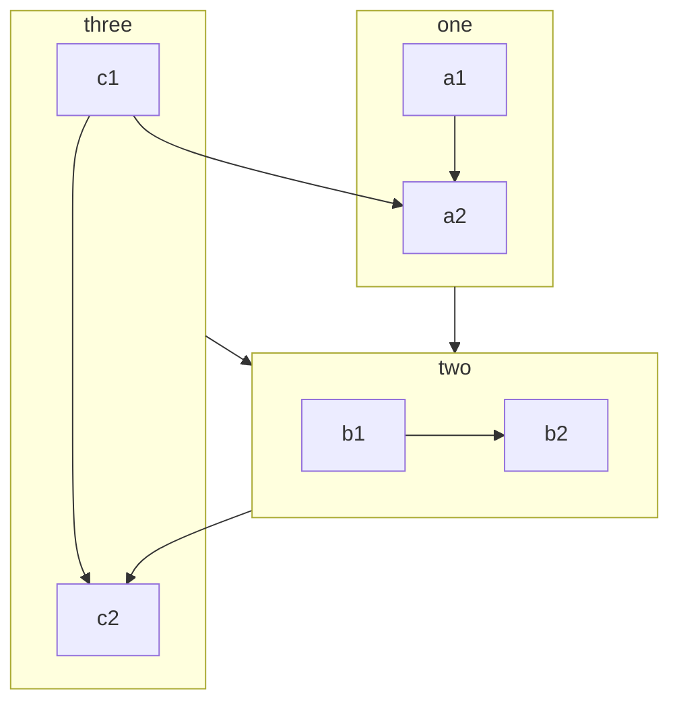

Start Notes: 

<small style="opacity: 0.7;">HELLO HELLO

Just a brief test on fonts, markdown sytax etc. </small>

---

#### 这是中文。

我改了字体，所以现在多写一点字，试一试是不是真的改了？

还有标点符号和生僻字：“风光旖旎的饕餮大餐。”

（非常傻地一开始用了 Google font 上的繁体中文字体）

---

#### Y español. ¡Hola! 

Algunas de mis prácticas de escritura aleatorias en español: 

Lo primero que noté es la actitud hacia los maestros. En China, las personas son muy educadas con ellos y usan 'por favor' cuando hablan. Casi nunca se dirigen directamente a ellos por su nombre. Sin embargo, aquí en Occidente es común hacerlo, y las relaciones son más cercanas, como de amigos. 

---

#### Markdown test: 

Tables and equations: 

| Function | Laplace Transform |
| --- | --- |
| $f(t)$ | $F(s) = \mathcal{L}[f(t)]$ |
| $1$ | $\frac{1}{s}$ |
| $t$ | $\frac{1}{s^2}$ |
| $t^n$ | $\frac{n!}{s^{n+1}}$ |
| $e^{at}$ | $\frac{1}{s-a}$ |
| $\sin(at)$ | $\frac{a}{s^2+a^2}$ |
| $\cos(at)$ | $\frac{s}{s^2+a^2}$ |

#### Mermaid flowchart

---

End Notes: 

<small style="opacity: 0.7;">That's all for now. 

Thanks to <i class="fab fa-youtube"></i> <a href="https://www.youtube.com/watch?v=q4qtiI2sY8I" style="text-decoration: none;">this playlist</a> i was able to stay awake. </small>

