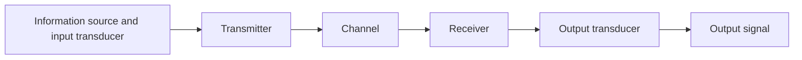

Start Notes: 

<small style="opacity: 0.7;"> I studied by going through the [lecture notes](https://github.com/thisisamor/blog_pic/blob/main/Communications/Comms2_notes_Spring.pdf) from last year. (This year EE department changed the prof for the course, whose lectures were unf much criticised.) 

[*Communication Systems by Haykin, Simon*](https://library-search.imperial.ac.uk/discovery/fulldisplay?docid=alma996665854401591&context=L&vid=44IMP_INST:ICL_VU1&lang=en&search_scope=MyInst_and_CI&adaptor=Local%20Search%20Engine&isFrbr=true&tab=Everything&query=any,contains,communication%20systems&sortby=date_d&facet=frbrgroupid,include,9028523163766173407&offset=0), the textbook, was well-written. </small>

---

## Introduction

*How do communication systems perform in the presence of noise and how is noise to be coped with?* 

### Definition

#### Signal
A single valued function of time that conveys information. 

#### Noise
The unwanted waves that disturb the transmission of signals, and over which we have incomplete control. 

#### Deterministic and random (stochastic) signals 确定性
A deterministic signal can be modelled as a completely specified function of time (no uncertainty at any time). 

A random signal must be modelled probabilistically. 

#### Analog and digital signals
An analog signal is a continuous function of **time**. 

Both may take on a continuum of values. 

#### Power
**Instantaneous power**
  $$ p = v(t)i(t) = \frac{\vert v(t)^2\vert}{R} = \vert i(t)^2\vert R $$

**Periodic signals**
  $$ P_{avg} = \frac{1}{T}\int_{-T/2}^{T/2}|g(t)|^2dt $$

**Non-periodic signals**
  $$ P_{avg} = \lim_{T \to \infty}\frac{1}{T}\int_{-T/2}^{T/2}|g(t)|^2dt $$

#### Energy 
  $$ \int_{-\infty}^{\infty} \vert g(t)^2 \vert dt $$

#### Bandwidth 
The extent of **significant spectral content** of the signal for positive frequencies. 

- Null-to-null bandwidth
- 3-dB bandwidth
- Equivalent noise bandwidth

#### Phasor
A general sinusoid: 
  $$y(t) = A\sin(\omega t + \phi) = A e^{j(\omega t + \phi)} $$
  
The waveform can be considered as <mark style="background-color: #9fc5e8;">the projection of a rotating phasor onto the real axis</mark>: 
  $$ \text{Re} (A e^{j(\omega t + \phi)} ) $$

---

## Noise 

*Noise is inevitable.*

*How to develop a model for the noise?*

### A Model of Noise

#### Source of noise

- External: 
  - atmospheric, galactic, synthetic...
- Internal: 
  - due to spontaneous fluctuation of current of voltage in electrical circuits
  - shot noise
    - the random arrival of electrons at the output of semicondector devices
    - Gaussian distributed with 0 mean
    - follows central limit theorem
  - thermal noise (Johnson noise)
    - the rapid and random motion of electrons within a condector due to thermal agitation
    - Gaussian distributed with 0 mean
    - follows central limit theorem
    - effective noise temperature: $T_e = \frac {P} {kB}$

#### The additive noise channel

Signal s(t) is corrupted by the addition of a random noise signal n(t): 

### A statistical Description of Noise

#### Probability

<mark style="background-color: #9fc5e8;">random variable</mark>

<mark style="background-color: #9fc5e8;">distribution functions</mark>

<mark style="background-color: #9fc5e8;">probability density functions</mark>

<mark style="background-color: #9fc5e8;">statistical average</mark>

<mark style="background-color: #9fc5e8;">random process</mark>

(see [maths B](https://github.com/thisisamor/blog_pic/blob/main/Maths/Maths-B-Probability.pdf))

#### Autocorrelation

#### Power spectral density

#### Wiener-Khinchine Theorem

The power spectral density of a random process is defined as the Fourier Transform of the autocorrelation function. 

### Representation of Bandlimited Noise

---

## Noise in Analog Communication Systems

### Baseband Communication System

SNR at the receiver output: 

$$ {SNR}_{baseband} = \frac {P_T} {N_o W} $$

To improve SNR: 
- increasing the transmitted power ($P_T$)
- restricting the message bandwidth ($W$)
- making the receiver less noisy ($N_o$)

### Amplitude Modulation (AM)

#### General form:

$$ s(t)_{AM} = (A+m(t)) cos(2 \pi f_c t) $$

#### Double-sideband suppressed carrier (DSB-SC)

$$ s(t)_{DSB-SC} = Am(t)cos(2 \pi f_c t) $$

#### Noise in DSB-SC

$$ P_N = \int_{-W}^{W} N_o df = 2 N_o W $$

$$ {SNR}_o = \frac {A^2 P} {2 N_o W} = \frac {P_T} {N_o W} $$

#### Synchronous detection

$$ SNR_{AM} = (\frac {P} {A^2 + P}) SNR_{baseband} $$

Performing AM is always worse than that of a baseband system, because of the wasted power which results from transmitting the carrier explicitly in the AM waveform. 

#### Envelope detection

### Frequency Modulation (FM)

### Comparison of Analogue Communication Systems

---

## Digital Communication Systems

---

## Information Theory and coding 

