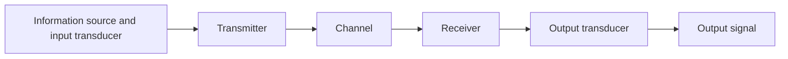

Start Notes: 

<small style="opacity: 0.7;"> I studied by going through the [lecture notes](https://github.com/thisisamor/blog_pic/blob/main/Communications/Comms2_notes_Spring.pdf) from last year. (This year EE department changed the prof for the course, whose lectures were unf much criticised.) 

[_Communication Systems by Haykin, Simon_](https://library-search.imperial.ac.uk/discovery/fulldisplay?docid=alma996665854401591&context=L&vid=44IMP_INST:ICL_VU1&lang=en&search_scope=MyInst_and_CI&adaptor=Local%20Search%20Engine&isFrbr=true&tab=Everything&query=any,contains,communication%20systems&sortby=date_d&facet=frbrgroupid,include,9028523163766173407&offset=0), the textbook, was well-written. </small>

---

## Introduction

Main question: *How do communication systems perform in the presence of noise and how is noise to be coped with?* 

### Definition

#### Signal
A single valued function of time that conveys information. 

#### Deterministic and random (stochastic) signals 确定性
A deterministic signal can be modelled as a completely specified function of time (no uncertainty at any time). 

A random signal must be modelled probabilistically. 

#### Analog and digital signals
An analog signal is a continuous function of **time**. 

Both may take on a continuum of values. 

#### Power
**Instantaneous power**
  $$ p = v(t)i(t) = \frac{\vert v(t)^2\vert}{R} = \vert i(t)^2\vert R $$

**Periodic signals**
  $$ P_{avg} = \frac{1}{T}\int_{-T/2}^{T/2}|g(t)|^2dt $$

**Non-periodic signals**
  $$ P_{avg} = \lim_{T \to \infty}\frac{1}{T}\int_{-T/2}^{T/2}|g(t)|^2dt $$

#### Energy 
  $$ \int_{-\infty}^{\infty} \vert g(t)^2 \vert dt $$

#### Bandwidth 
The extent of **significant spectral content** of the signal for positive frequencies. 

- Null-to-null bandwidth
- 3-dB bandwidth
- Equivalent noise bandwidth

#### Phasor
The waveform can be considered as <mark style="background-color: #9fc5e8;">the projection of a rotating phasor onto the real axis</mark>. 
  $$y(t) = A\sin(\omega t + \phi) = \text{Re} (A e^{j(\omega t + \phi)} ) $$

---

## Noise 

---

## Noise in Analog Communication Systems

---

## Digital Communication Systems

---

## Information Theory and coding 

