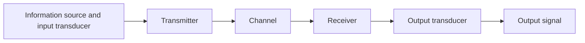

Start Notes: 

<small style="opacity: 0.7;"> I studied by going through the [lecture notes](https://github.com/thisisamor/blog_pic/blob/main/year2/Communications/Comms2_notes_Spring.pdf) from last year. (This year EE department changed the prof for the course, whose lectures were unf much criticised.) 

[*Communication Systems by Haykin, Simon*](https://library-search.imperial.ac.uk/discovery/fulldisplay?docid=alma996665854401591&context=L&vid=44IMP_INST:ICL_VU1&lang=en&search_scope=MyInst_and_CI&adaptor=Local%20Search%20Engine&isFrbr=true&tab=Everything&query=any,contains,communication%20systems&sortby=date_d&facet=frbrgroupid,include,9028523163766173407&offset=0), the textbook, was well-written. </small>

---

## Introduction

*How do communication systems perform in the presence of noise and how is noise to be coped with?* 

### Definition

#### Signal
A single valued function of time that conveys information. 

#### Noise
The unwanted waves that disturb the transmission of signals, and over which we have incomplete control. 

#### Deterministic and random (stochastic) signals 确定性
A deterministic signal can be modelled as a completely specified function of time (no uncertainty at any time). 

A random signal must be modelled probabilistically. 

#### Analog and digital signals
An analog signal is a continuous function of **time**. 

Both may take on a continuum of values. 

#### Power
**Instantaneous power**
  $$ p = v(t)i(t) = \frac{\vert v(t)^2\vert}{R} = \vert i(t)^2\vert R $$

**Periodic signals**
  $$ P_{avg} = \frac{1}{T}\int_{-T/2}^{T/2}|g(t)|^2dt $$

**Non-periodic signals**
  $$ P_{avg} = \lim_{T \to \infty}\frac{1}{T}\int_{-T/2}^{T/2}|g(t)|^2dt $$

#### Energy 
  $$ \int_{-\infty}^{\infty} \vert g(t)^2 \vert dt $$

#### Bandwidth 
The extent of **significant spectral content** of the signal for positive frequencies. 

- Null-to-null bandwidth
- 3-dB bandwidth
- Equivalent noise bandwidth

#### Phasor
A general sinusoid: 
  $$y(t) = A\sin(\omega t + \phi) = A e^{j(\omega t + \phi)} $$
  
The waveform can be considered as <mark style="background-color: #9fc5e8;">the projection of a rotating phasor onto the real axis</mark>: 
  $$ \text{Re} (A e^{j(\omega t + \phi)} ) $$

---

## Noise 

*Noise is inevitable.*

*How to develop a model for the noise?*

### A Model of Noise

#### Source of noise

- External: 
  - atmospheric, galactic, synthetic...
- Internal: 
  - due to spontaneous fluctuation of current of voltage in electrical circuits
  - shot noise
    - the random arrival of electrons at the output of semicondector devices
    - Gaussian distributed with 0 mean
    - follows central limit theorem
  - thermal noise (Johnson noise)
    - the rapid and random motion of electrons within a condector due to thermal agitation
    - Gaussian distributed with 0 mean
    - follows central limit theorem
    - $P_{thermal}=kTB$
    - effective noise temperature: $T_e = \frac {P} {kB}$

#### The additive noise channel

Signal s(t) is corrupted by the addition of a random noise signal n(t): 

### A statistical Description of Noise

#### Probability

Random experiment: an experiment whose outcome cannot be predicted precisely; 

Event: a collection of possible outcomes of the random experiment; 

Sample space $S$: the event of all possible separately identifiable outcomes; 

<mark style="background-color: #9fc5e8;">Random variable $x$</mark>: a rule or relationship that assigns a real number $x_i$ to the $i^{th}$ sample point in the sample space $x_i \in S$; 

Probability $P_X(x_i)$: the probability of random variable $x$ taking the value $x_i$; (Includes all possible outcomes of the experiment is 1; Probability of two events that do not have any common outcome is the sum of the probabilities of the two events separately.)

<mark style="background-color: #9fc5e8;">Distribution functions</mark>: (also called cumulative function) the probability of the variable taking the value less than the argument of the distribution function; 

$$ F_f(z) \equiv P_f (f \leq q ) $$

$F_f(z)$ is the distribution function, $P_f$ is the probability, $f$ is the random variable and $z$ is a number. 

$$ F_f(-\infty) = 0 \quad F_f(\infty) = 1 $$

<mark style="background-color: #9fc5e8;">Probability density functions</mark>: the derivative of the distribution function; 

$$ p_f(f) \equiv \frac{d}{dz} F_f(z) $$

Gaussian pdf: $$ p_x(x) = \frac{1}{\sigma \sqrt{2\pi}} e^{-(x-m)^2/(2\sigma^2)} $$

<mark style="background-color: #9fc5e8;">Expected value $E \lbrace f \rbrace$</mark>: (also called mean value) $$ E \lbrace f \rbrace \equiv \mu_f \equiv \int_{-\infty}^{\infty} zp_f(z)dz $$

Expectation operator: $E \lbrace . \rbrace$

Variance: 
$$ \sigma^2_f \equiv E\lbrace (f-\mu_f)^2 \rbrace =  E\lbrace f^2 \rbrace - \mu^2_f $$

For a zero-mean random variable, the variance is equal to the mean square. 

<mark style="background-color: #9fc5e8;">Random process</mark>: a time-varying function that assigns the outcome of a random experiment to each time instant $f(t;s_i)$; 

<mark style="background-color: #9fc5e8;">Autocorrelation function</mark>: 

$$ R_{ff}(t_1, t_2) \equiv E\lbrace f(t_1;s_i)f(t_2;s_i) \rbrace = \int_{-\infty}^{\infty} \int_{-\infty}^{\infty} z_1 z_2 p_f(z_1, z_2; t_1, t_2)dz_1 dz_2 $$

Stationary random process: 
1. the expectation value doesn't depend on $t$; 
2. the autocorrelation function is translation invariant: $$R_{ff}(t_1, t_2) = E\lbrace f(t_1+t_0;s_i)f(t_2+t_0;s_i) \rbrace $$ for any $t_0$. 

(see [maths B](https://github.com/thisisamor/blog_pic/blob/main/year2/Maths/Maths-B-Probability.pdf))

#### Autocorrelation

#### Power spectral density

#### Wiener-Khinchine Theorem

The power spectral density of a random process is defined as the Fourier Transform of the autocorrelation function. 

### Representation of Bandlimited Noise

Any communication system that uses carrier modulation will typically have a bandpass filter at the front end of the receiver, which allows the modulated signal to pass, and is designed to restrict out-of-band noise from entering the receiver. 

#### Bandpass representation

$$ n(t) = n_I(t)cos(2\pi f_c t) - n_Q(t)sin(2\pi f_c t) $$

where: 

$$ n_I(t) = \sum_{k} a_k cos(2\pi (f_k - f_c )t  + \theta_k) $$
$$ n_Q(t) = \sum_{k} a_k sin(2\pi (f_k - f_c )t  + \theta_k) $$

#### Average power and power spectral density

#### Phasor representation

$$ n(t) = Re \lbrace g(t)e^{j2\pi f_ct} \rbrace $$

$$ g(t) = n_I(t) + jn_Q(t) $$

$$ g(t) = r(t)e^{j\phi (t)} $$

where: 

$$ Envelope: \ r(t) = \sqrt { n_I(t)^2 + n_Q(t)^2} $$
$$ Phase: \ \phi (t) = tan^{-1}[n_Q(t)/n_I(t)] $$

If $n_I(t)$ and $n_Q(t)$ are Gaussian-distributed, then envelope of the noise (ie. the magnitude $r(t)$) has a Rayleigh distribution, and the phase of the noise (ie. $\phi (t)$) is uniformly distributed. 

---

## Noise in Analog Communication Systems

<mark style="background-color: #9fc5e8;">Signal-to-noise ratio (SNR)</mark>: measures the **performance** of the channel (not the efficiency). 

### Baseband Communication System

SNR at the receiver output: 

$$ {SNR}_{baseband} = \frac {P_T} {N_o W} $$

To improve SNR: 
- increasing the transmitted power ($P_T$)
- restricting the message bandwidth ($W$)
- making the receiver less noisy ($N_o$)

### Amplitude Modulation (AM)

#### General form:

$$ s(t)_{AM} = (A+m(t)) cos(2 \pi f_c t) $$

#### Double-sideband suppressed carrier (DSB-SC)

$$ s(t)_{DSB-SC} = Am(t)cos(2 \pi f_c t) $$

#### Noise in DSB-SC

$$ P_N = \int_{-W}^{W} N_o df = 2 N_o W $$

$$ {SNR}_o = \frac {A^2 P} {2 N_o W} = \frac {P_T} {N_o W} $$

#### Synchronous detection

$$ SNR_{AM} = (\frac {P} {A^2 + P}) SNR_{baseband} $$

Performing AM is always worse than that of a baseband system, because of the wasted power which results from transmitting the carrier explicitly in the AM waveform. 

#### Envelope detection

### Frequency Modulation (FM)

$$ s(t) = A cos[ 2\pi f_ct +2\pi k_f \int_{-\infty}^{t}m(\tau)d\tau ] $$

<mark style="background-color: #9fc5e8;">Frequency deviation</mark>

<mark style="background-color: #9fc5e8;">Deviation ratio (FM modulation index)</mark>

#### Carson's rule

$$ B_T = 2W(\beta +1) = 2(\Delta f + W) $$

### Comparison of Analogue Communication Systems

---

## Digital Communication Systems

---

## Information Theory and coding 

